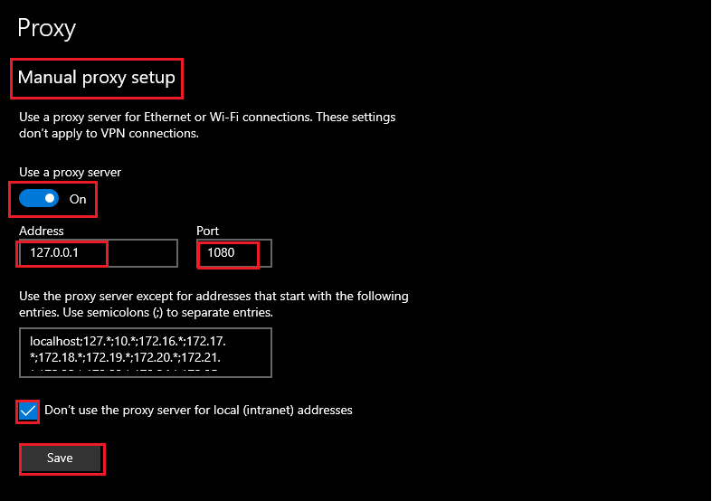

# socks5-tunnel

[*socks5-tunnel*](https://github.com/klu-dev/socks5-tunnel) is socks5 proxy which do not have authentication. Socks5 protocol supports username/password authentication. But most applications such as Chrome, do not support socks5 authentication and consider it is not safe. There is a scenario that users want to have a private socks5 proxy and do not want unauthenticated users to use this proxy. *socks5-tunnel* aims to address this scenario.

[*socks5-tunnel*](https://github.com/klu-dev/socks5-tunnel) also support HTTP proxy without authentication which is Windows 10 proxy mode.

[*socks5-tunnel*](https://github.com/klu-dev/socks5-tunnel)  support the following features:

- Support Socks V5 protocol
- Support HTTP proxy protocol
- Filter IPv4 public network addresses to bypass traffice directly to target server instead of delivering them to proxy server.
- Keep alive and dectect proxy server periodicaly. Bypass all traffic to target server directly if the proxy server is unreachable. And switch back when the proxy server comes back.

## Usage

1. First, need to install [`rust`](https://www.rust-lang.org/), then build the program in project directory

   ```
   $ cargo build
   ```

   The binary `socks5-tunnel` for Linux or `sokcs5-tunnel.exe` for Windows are in `socks5-tunnel\target\debug`.

2. Generate two pair secret keys. 

   ```
   D:\code\socks5-tunnel\target\debug>.\socks5-tunnel.exe -g
   Private key:
   f8084cd3d6c9fc713cb2bb645dbdd065c7c639d67b296ee73335b06fae26c642
   Public key:
   4d67400cfb0d88d60383dc1a06bf3db241d0b292d344c808d142f30bed530569
   
   D:\code\socks5-tunnel\target\debug>.\socks5-tunnel.exe -g
   Private key:
   a80cd6eeda9e11907a17c40e05ee5f7f31924824ae25a344b9ff2796918f2258
   Public key:
   4ab933848af90179f344cc3f955c12d82cf7eec1c1558566b731252719c92525
   ```

   **Note: You must generate the secret keys yourself. Do not use the keys here. Do not leak your secret keys**

3. Copy program to server machine and run it in server mode:

   ```
   D:\code\socks5-tunnel\target\debug>.\socks5-tunnel.exe -m Server -l 0.0.0.0:1080 -k f8084cd3d6c9fc713cb2bb645dbdd065c7c639d67b296ee73335b06fae26c642 -b 4ab933848af90179f344cc3f955c12d82cf7eec1c1558566b731252719c92525
   Work in server mode...
   Listening on: /ip4/0.0.0.0/tcp/1080
   ```

   **Need to add socks5-tunnel.exe in the allowed app through firewall in Windows 10.  Configure `Setting` -> `Network & Internet` -> `Windows Firewall` -> `Allow an app through firewall`**

   

4. Copy program to client machine and run it in client mode. Client mode support **SOCKS v5 (Default)** and **HTTP** proxy portocol.

   1. Client configure in **SOCKS v5**: 

      Assuming your server machine IP is 192.168.1.2

      ```
      D:\code\socks5-tunnel\target\debug>.\socks5-tunnel.exe -m client -l 127.0.0.1:1080 -p 192.168.1.2:1080 -k a80cd6eeda9e11907a17c40e05ee5f7f31924824ae25a344b9ff2796918f2258 -b 4d67400cfb0d88d60383dc1a06bf3db241d0b292d344c808d142f30bed530569
      Work in client mode...
      Listening on: /ip4/127.0.0.1/tcp/1080
      ```

      or with bypass filter

      ```
      D:\code\socks5-tunnel\target\debug>.\socks5-tunnel.exe -m client -l 127.0.0.1:1080 -p 192.168.1.2:1080 -k a80cd6eeda9e11907a17c40e05ee5f7f31924824ae25a344b9ff2796918f2258 -b 4d67400cfb0d88d60383dc1a06bf3db241d0b292d344c808d142f30bed530569 -y filter_ip.txt
      Work in client mode...
      Listening on: /ip4/127.0.0.1/tcp/1080
      ```

      Set chrome proxy.

      One method for Chrome or Edge browser using socks5 proxy, start the chrome program with parameter:

      ```
      --proxy-server="SOCKS5://127.0.0.1:1080"
      ```

      For example in Windows, run command:

      ```
      "C:\Program Files (x86)\Google\Chrome\Application\chrome.exe" --proxy-server="SOCKS5://127.0.0.1:1080"
      ```

      Another way is duplicating chrome shortcut. Add ` --proxy-server="SOCKS5://127.0.0.1:1080"` in `Target` item of `Shortcut` tab properties.

   2. Client configure in **HTTP** proxy:

      Assuming your server machine IP is 192.168.1.2

      ```
      D:\code\socks5-tunnel\target\debug>.\socks5-tunnel.exe -m client -t http -l 127.0.0.1:1080 -p 192.168.1.2:1080 -k a80cd6eeda9e11907a17c40e05ee5f7f31924824ae25a344b9ff2796918f2258 -b 4d67400cfb0d88d60383dc1a06bf3db241d0b292d344c808d142f30bed530569 -y filter_ip.txt
      Work in client mode...
      Listening on: /ip4/127.0.0.1/tcp/1080
      ```

      Set Proxy configuration in Windows 10 `Setting` -> `Network & Internet` -> `Proxy`

      
      
      Except IP configuration is optonal. It could be:
      
      ```
      localhost;127.*;10.*;172.16.*;172.17.*;172.18.*;172.19.*;172.20.*;172.21.*;172.22.*;172.23.*;172.24.*;172.25.*;172.26.*;172.27.*;172.28.*;172.29.*;172.30.*;172.31.*;172.32.*;192.168.*
      ```
      
      **Note: Windows 10 Proxy is global setting. So no need to configure proxy parameter in Chrome or Edge browser.**

5. Filter text format is public `network address`/`mask bits` mask bits is between 8 and 24 for example:

   ```
   113.197.100.0/22
   113.200.0.0/15
   113.202.0.0/16
   113.204.0.0/14
   113.208.64.0/19
   ```

6. Help

   ```
   D:\code\socks5-tunnel\target\debug>.\socks5-tunnel.exe --help
   ```

7. Show log.

   Add environment RUST_LOG=info/debug/trace *before* start the program.

   Windows cmd:

   ```
   D:\code\socks5-tunnel\target\debug> set RUST_LOG=info
   ```

   Linux bash:

   ```
   export RUST_LOG=info
   ```

## Solution

```
                      ______________________________________________
                      | __________________________________________  |
         tcp          | |           Noise Encrypt Tunnels         | |          tcp
Browser -----> Client Mode Proxy                            Server Mode Proxy ------> Destination Web Site
```

Client proxy run in machine which Browser runs, accept connection and create [Noise](http://noiseprotocol.org/) encrypt connection to server proxy.  It transfer data from Browser to Server proxy transparently. Server proxy run in machine which can access destination web sites. Server proxy implement socks5 protocol and create connection to destination web sites. Data flows between Browser, Client proxy, Server proxy and Destination web sites.

Every connection from Browser will create a Noise encrypt connection between client proxy and server proxy to deliver data from browser to destination web site. An alternative use multiplexer between client proxy and server proxy on one connection to decrease the number of connections. One multiplexer is [*Yamux*](https://github.com/hashicorp/yamux/blob/master/spec.md). The problem is [*Yamux*](https://github.com/hashicorp/yamux/blob/master/spec.md) has no priority management. Different stream has the same priority. In extreme cases, one stream may occupy the whole traffic and causes other streams starvation. But in some scenario such as connection number limitations case, multiplexer is useful.

## Secure Analysis

Noise encrypt tunnel uses Noise [KK](https://noiseexplorer.com/patterns/KK/) mode. It use fixed key pair as authentication function. Assuming client proxy and server proxy obtain peer public key, which can be generated through command `.\socks5-tunnel.exe -g`, in advance through other ways. Attackers need to know server public key and client private key, otherwise they can not connect to server.

Compared with https proxy, the noise protocol is more simple without CA and has been used by [*WireGuard*](https://www.wireguard.com/)

## Future work

* Support multiplexer for noise tunnel

* Add *Relay* mode to relay data from start proxy to server proxy

## How is this module organized?

crypto&emsp;&emsp;&emsp;&emsp;&emsp;&emsp;&emsp;&emsp;&emsp;&emsp;&emsp;&emsp; # porting from [libra](https://github.com/libra/libra) to provide API for secret key   operations  
crypto-derive &emsp;&emsp;&emsp;&emsp;&emsp;&emsp;&emsp;&emsp;&nbsp;&nbsp; # porting from [libra](https://github.com/libra/libra) to provide macros used by crypto library  
memsocket&emsp;&emsp;&emsp;&emsp;&emsp;&emsp;&emsp;&emsp;&emsp;&nbsp;&nbsp; # porting from [libra](https://github.com/libra/libra) to simulate transport  in memory used for tests  
src  
|---- noise&emsp;&emsp;&emsp;&emsp;&emsp;&emsp;&emsp;&emsp;&emsp;&emsp;&nbsp; # porting from [libra](https://github.com/libra/libra) to implement noise futures and transport  
|---- transport&emsp;&emsp;&emsp;&emsp;&emsp;&emsp;&emsp;&emsp;&nbsp;&nbsp; # porting from [libra](https://github.com/libra/libra) to abstract general protocol concept  
|---- build_transport&emsp;&emsp;&emsp;&emsp;&emsp;&emsp;&nbsp;# upgrade tcp transport to noise transport  
|---- command&emsp;&emsp;&emsp;&emsp;&emsp;&emsp;&emsp;&emsp;&nbsp;&nbsp;# parse command arguments  
|---- end_node&emsp;&emsp;&emsp;&emsp;&emsp;&emsp;&emsp;&emsp;&nbsp;&nbsp;# server mode proxy  
|---- server&emsp;&emsp;&emsp;&emsp;&emsp;&emsp;&emsp;&emsp;&emsp;&emsp;&nbsp;# transport listening stream accept  
|---- socks&emsp;&emsp;&emsp;&emsp;&emsp;&emsp;&emsp;&emsp;&emsp;&emsp;&nbsp;&nbsp;# utility functions  
|---- start_node&emsp;&emsp;&emsp;&emsp;&emsp;&emsp;&emsp;&emsp; # client mode proxy

# License

This project is licensed under either of

* Apache License, Version 2.0, ([LICENSE-APACHE](LICENSE-APACHE) or
  [http://www.apache.org/licenses/LICENSE-2.0])
* MIT license ([LICENSE-MIT](LICENSE-MIT) or
  [http://opensource.org/licenses/MIT])

at your option.

