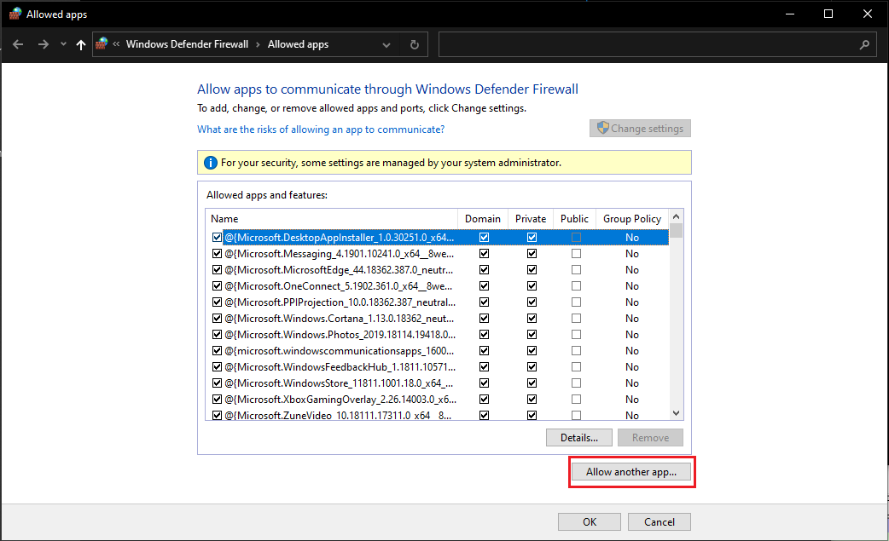

# socks5-tunnel

 [*socks5-tunnel*](https://github.com/klu-dev/socks5-tunnel) 是 SOCKS v5 和  HTTP 隧道代理。在客户端和服务器端使用双向的 [Noise](http://noiseprotocol.org/) 加密协议。[*socks5-tunnel*](https://github.com/klu-dev/socks5-tunnel) 可用于私有 SOCKS 或者 HTTP 代理，没有客户端私钥将无法访问服务代理。代理隧道模式如下：

```
                      ______________________________________________
                      |  _________________________________________  |
                      | |                Https                    | |
                      | |_________________________________________| |
                      |                  Socks                      |
                      |  _________________________________________  |
  SOCKS or Http       | |           Noise Encrypt Tunnels         | |                         Https
浏览器 -----> socks5-tunnel（Client 模式）                          socks5-tunnel（Server 模式） ------> Destination Web Site
                  |                                                                                         |
                  | 旁路模式                                                                                 |
                  |_________________________________________________________________________________________|

```

和浏览器运行在一起的客户模式代理程序监听指定端口，接受来自浏览器的连接并创建与远端代理服务器的  [Noise](http://noiseprotocol.org/)  加密连接，远端代理服务器通过Socks V5 协议与客户端代理程序协商获得目标Web服务器主机名，并发起与目标服务器 的TCP连接，连接成功后，浏览器创建与目标服务器的SSL加密通道，客户端和服务器端的代理只用于传递数据，并不能解密数据的内容。

[*socks5-tunnel*](https://github.com/klu-dev/socks5-tunnel) 支持旁路模式，它会定期检测远端代理服务器的状态，如果远端代理服务器无法访问，则自动切换为全部旁路模式，直连目标服务器，从而保证浏览器任可以继续访问远端的 Web 服务器。[*socks5-tunnel*](https://github.com/klu-dev/socks5-tunnel) 提供了一个 IP 列表配置，可以设置直接旁路的 IP 地址列表。比如用户可以配置访问国内网站的时候使用旁路模式，访问国外网站使用远端的代理服务器。

目前 [*socks5-tunnel*](https://github.com/klu-dev/socks5-tunnel) 支持以下特性：

- 支持 Socks V5 协议
- 支持 HTTP 代理协议
- 客户端代理服务器支持旁路 IPv4 网络地址列表，用于直连目标Web服务器。
- 客户端代理服务器定期检测远端代理服务器的状态，如果远端代理服务器无法访问，则自动切换为旁路模式，直连目标服务器。并且当检测到远端代理服务器可用，则切换回隧道模式。

## Usage

1. 首先安装 [`rust`](https://www.rust-lang.org/), 编译程序，然后在项目目录下编译程序

   ```
   $ cargo build
   ```

    在`socks5-tunnel\target\debug`目录下将生成二进制程序。 Linux 下是 `socks5-tunnel` 或者 Windows 下是 `sokcs5-tunnel.exe`

2. 生成两组随机 <公，私> 密钥对 供客户端和服务器端使用

   ```
   D:\code\socks5-tunnel\target\debug>.\socks5-tunnel.exe -g
   Private key:
   f8084cd3d6c9fc713cb2bb645dbdd065c7c639d67b296ee73335b06fae26c642
   Public key:
   4d67400cfb0d88d60383dc1a06bf3db241d0b292d344c808d142f30bed530569
   
   D:\code\socks5-tunnel\target\debug>.\socks5-tunnel.exe -g
   Private key:
   a80cd6eeda9e11907a17c40e05ee5f7f31924824ae25a344b9ff2796918f2258
   Public key:
   4ab933848af90179f344cc3f955c12d82cf7eec1c1558566b731252719c92525
   ```

   **注意: 你必须自己生成密钥对用于你的代理，不要使用上面的密钥对。并且不要泄露你的密钥对。**

3. 拷贝程序到远端代理服务器机器上，运行在 server 模式，其中 `-l` 是监听端口，`-k` 是服务器端的私钥，`-b` 是客户端的公钥:

   ```
   D:\code\socks5-tunnel\target\debug>.\socks5-tunnel.exe -m Server -l 0.0.0.0:1080 -k f8084cd3d6c9fc713cb2bb645dbdd065c7c639d67b296ee73335b06fae26c642 -b 4ab933848af90179f344cc3f955c12d82cf7eec1c1558566b731252719c92525
   Work in server mode...
   Listening on: /ip4/0.0.0.0/tcp/1080
   ```

   **Windows 10 下，需要把 socks5-tunnel.exe 程序加到防火墙允许列表中。设置防火墙 `设置` -> `网络和互联网` -> `防火墙` -> `允许程序穿过防火墙`**

   

4. 拷贝程序到客户端机器，运行在 Client 模式。 Client 模式**默认**使用 **SOCKS v5** 协议 参数 `-t` 可用于设置代理协议 `socks` 或者 `http`。

   1. 客户端配置 **SOCKS v5**: 

      假设远端服务器 IP 是 192.168.1.2，运行如下命令，其中 `-k` 是客户端的私钥，`-b` 是服务器端的公钥

      ```
      D:\code\socks5-tunnel\target\debug>.\socks5-tunnel.exe -m client -l 127.0.0.1:1080 -p 192.168.1.2:1080 -k a80cd6eeda9e11907a17c40e05ee5f7f31924824ae25a344b9ff2796918f2258 -b 4d67400cfb0d88d60383dc1a06bf3db241d0b292d344c808d142f30bed530569
      Work in client mode...
      Listening on: /ip4/127.0.0.1/tcp/1080
      ```

      或者加上旁路 IP 网络地址列表文件 `-y` 旁路 IP 网络地址列表文件

      ```
      D:\code\socks5-tunnel\target\debug>.\socks5-tunnel.exe -m client -l 127.0.0.1:1080 -p 192.168.1.2:1080 -k a80cd6eeda9e11907a17c40e05ee5f7f31924824ae25a344b9ff2796918f2258 -b 4d67400cfb0d88d60383dc1a06bf3db241d0b292d344c808d142f30bed530569 -y filter_ip.txt
      Work in client mode...
      Listening on: /ip4/127.0.0.1/tcp/1080
      ```

      设置 Chrome 或 Edge 浏览器 代理参数.

      一种方法是带参数命令行启动浏览器，参数如下:

      ```
      --proxy-server="SOCKS5://127.0.0.1:1080"
      ```

      Windows 下运行命令行如下:

      ```
      "C:\Program Files (x86)\Google\Chrome\Application\chrome.exe" --proxy-server="SOCKS5://127.0.0.1:1080"
      ```

      另一种方法是安装 [Proxy SwitchyOmega - Microsoft Edge Addons](https://microsoftedge.microsoft.com/addons/detail/proxy-switchyomega/fdbloeknjpnloaggplaobopplkdhnikc?hl=en-US) 浏览器插件，在插件里设置 Sock 代理

   2. 客户端配置 **HTTP** 代理:

      假设远端服务器 IP 是 192.168.1.2，运行如下命令，其中 `-t` 设置 代理协议

      ```
      D:\code\socks5-tunnel\target\debug>.\socks5-tunnel.exe -m client -t http -l 127.0.0.1:1080 -p 192.168.1.2:1080 -k a80cd6eeda9e11907a17c40e05ee5f7f31924824ae25a344b9ff2796918f2258 -b 4d67400cfb0d88d60383dc1a06bf3db241d0b292d344c808d142f30bed530569 -y china_ip.txt
      Work in client mode...
      Listening on: /ip4/127.0.0.1/tcp/1080
      ```

      设置 Windows 10 系统代理 `设置` -> `网络和互联网` -> `代理`

      

      排除 IP 配置 是可选项. 可以加下面的配置:

      ```
      localhost;127.*;10.*;172.16.*;172.17.*;172.18.*;172.19.*;172.20.*;172.21.*;172.22.*;172.23.*;172.24.*;172.25.*;172.26.*;172.27.*;172.28.*;172.29.*;172.30.*;172.31.*;172.32.*;192.168.*
      ```

      **注意：Windows 10 代理配置是全局代理，所以不需要再做浏览器的代理设置**

5. 旁路 IP 地址列表文件的格式是 `network address`/`mask bits` 掩码位数在 8 and 24 之间，例如:

   ```
   113.197.100.0/22
   113.200.0.0/15
   113.202.0.0/16
   113.204.0.0/14
   113.208.64.0/19
   ```

   源码中 `china_ip.txt` 文件通过在 Linux 下执行如下命令，从 APNIC 获取并过滤中国大陆和中国香港地区的 IPv4 地址段

   ```
   curl 'http://ftp.apnic.net/apnic/stats/apnic/delegated-apnic-latest' | grep ipv4 | grep -E "CN|HK" | awk -F\| '{ printf("%s/%d\n", $4, 32-log($5)/log(2)) }' >china_ip.txt
   ```

6. 帮助

   ```
   D:\code\socks5-tunnel\target\debug>.\socks5-tunnel.exe --help
   ```

7. 显示日志

   添加环境变量在启动程序之前 `RUST_LOG=info` 或者 `debug`  或者 `trace`

   Windows 命令

   ```
   D:\code\socks5-tunnel\target\debug> set RUST_LOG=info
   ```

   Linux bash

   ```
   export RUST_LOG=info
   ```

